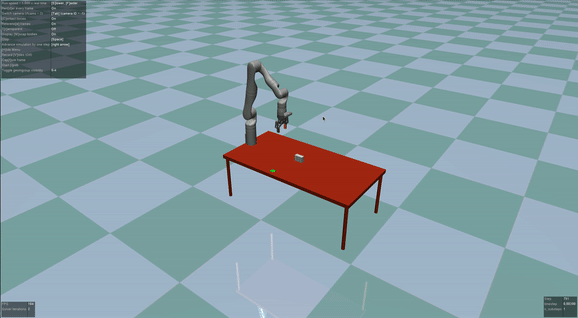
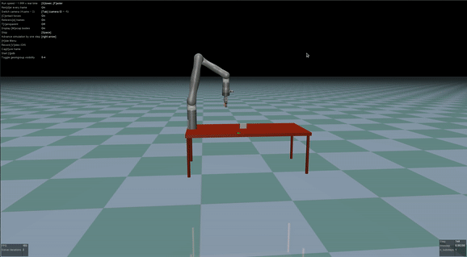
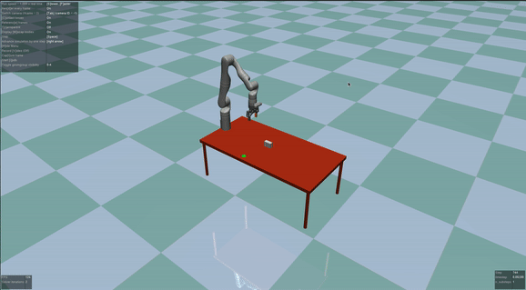

# mujoco-arm

| &nbsp;&nbsp;&nbsp;&nbsp;&nbsp;&nbsp;Push&nbsp;&nbsp;&nbsp;&nbsp;&nbsp;&nbsp;&nbsp;&nbsp; | PickAndPlace | &nbsp;&nbsp;&nbsp;&nbsp;&nbsp;&nbsp;&nbsp;Slide&nbsp;&nbsp;&nbsp;&nbsp;&nbsp;&nbsp;&nbsp; |
|-----------------------|-----------------------|-----------------------|
|  |  |  |

This Python project uses MuJoCo simulation to control [six degrees of freedom Gen3 robotic arm](https://www.kinovarobotics.com/product/gen3-robots). The project aims to control the robot with three specific actions: push, pick-and-place, and push. For instructions on running the program, please see below.

## Install requirements

```bash
pip install -r ./requirements.txt
```

## Start demo on a specific action

```bash
bash script_<action>.script
```

Options for <action>
- push
- pap (pick-and-place)
- slide

## Acknowledgement

This repository is developed from [Dr. Cui](https://www.jindacui.com/bio) source code.
